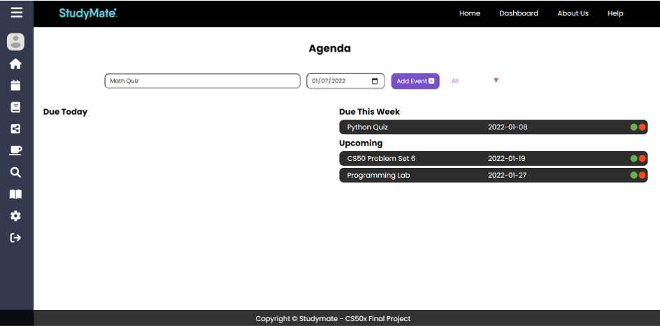
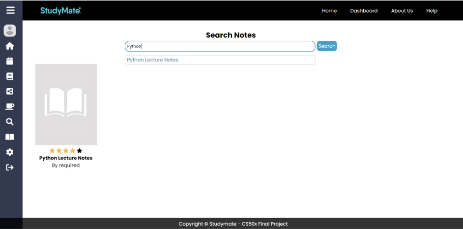
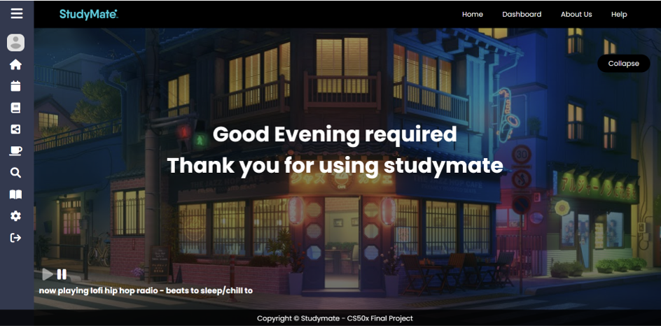

# 📚 Studymate 📖
## Alfonsus Rodriques Rendy | Nicholas Sidharta
### CS50 Final Project

## 🎞️ Video Demo
Add Link Here

## 🌐 Check Out the Web App
Add link Here

## Description:
### About the Project
Studymate is a web application designed to help students and learners in their studying journey. Studymate is built to establish an ease of access to different types of necessity when learning or discovering new things. Our goal is to create the perfect virtual studying environment so that students can focus more on their studies. Our platform is a community based system where the community will decide the workflow of this web application.

#### Our Vision
We envision a world where anyone, anywhere has the power to transform their life through learning.

#### Our Mission
We believe that learning is crucial for human development. But, sometimes the process of learning is not easy. There are many people that have limited or even no access to education. Some people have, but sometimes they don't have access to additional material. Our commitement is to ensure that students can learn from anyone, anywhere and to make the process of learning to be fun. We are here to ensure that everyone has their own studymate

### Features
<ol>
  <li>Agenda</li>
  This is a page where users can keep track of their own agenda for future planning.
  <li>Note Sharing</li>
  This is a page where users can upload their notes and manage uploaded notes as well as see their note's ratings.
  <li>Search Course</li>
  This is a page where users can find courses and rate courses based on their experience.
  <li>Relax Room</li>
  This is a page where users can relax while studying accompanied by their own choice of background picture and music.
</ol>

### How to Use Studymate
<ol>
  <li>Visit the Website</li>
  <li>Create Your Account</li>
  <li>Log In</li>
  <li>Explore to Your Heart's Content :)</li>
</ol>

### File Details
1. account: a file directory that has all files and collect data related to logging in, registering, and customizing user accounts and experiences
  a. __pycache__: ?
  b. migrations: ?
  c. templates\account: a file directory that keeps all the HTML for pages that relate to user accounts and personalization
  - edit.html: a HTML file that represents the content of the the edit profile page
  - login.html: a HTML file that represents the content of the the login page
  - profile.html: a HTML file that represents the content of the the view profile page
  - register.html: a HTML file that represents the content of the register page
  - settings.html: a HTML file that represents the content of the personalization page
  d. __init__.py: ?
  e. admin.py: ?
  f. apps.py: ?
  g. backends.py: ?
  h. models.py: ?
  i. tests.py: ?
  j. urls.py: ?
  k. views.py: ?

2. course: a file directory that has all files and collect data related to displaying courses to keeping track of user's courses

3. dashboard: a file directory that has most of the features pages including the dashboard itself, the agenda page, the error page, and some informational pages.

4. media: a file directory that keeps all images that is necessary to the website

5. notes: a file directory that has all files and collect data related to note sharing and uploading as well as managing notes

6. static: a file directory that keeps all the css and javascript codes for all the pages

7. studymate: ?

8. templates: a file directory that keeps the main templates of every page such as navbars and sidebars

9. db.sqlite3: a database that keeps all the uploaded data

10. LICENSE: a file that explains the MIT license

11. requirements.txt: a text file that shows all the packages needed to run the application

12. requirements2.txt: a text file that shows all the packages needed to run the application

### Previews

